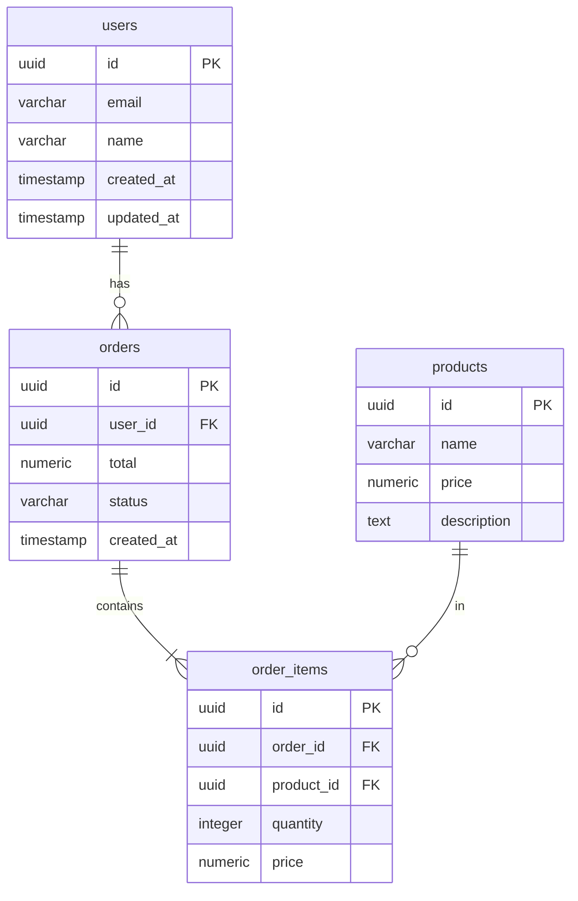

# Export & Import Schemas

## Overview

Export your Drizzle schemas to various formats for documentation, sharing, or visualization. Import schemas from JSON to generate Drizzle code automatically.

Supported export formats:
- **JSON Schema** - Standard schema format for interoperability
- **TypeScript** - Type definitions and Zod schemas
- **Mermaid** - ERD diagrams for documentation

## Export Schemas

### JSON Schema Format

Export schemas to JSON Schema format, compatible with many tools and validators.

```bash
npx drizzle-multitenant export --format=json > schemas.json

# With metadata
npx drizzle-multitenant export --format=json --include-metadata > schemas.json
```

Output example:

```json
{
  "$schema": "http://json-schema.org/draft-07/schema#",
  "definitions": {
    "users": {
      "type": "object",
      "properties": {
        "id": {
          "type": "string",
          "format": "uuid",
          "description": "Primary key"
        },
        "email": {
          "type": "string",
          "format": "email"
        },
        "name": {
          "type": "string"
        },
        "created_at": {
          "type": "string",
          "format": "date-time"
        }
      },
      "required": ["id", "email", "created_at"],
      "primaryKey": ["id"],
      "foreignKeys": []
    },
    "orders": {
      "type": "object",
      "properties": {
        "id": {
          "type": "string",
          "format": "uuid"
        },
        "user_id": {
          "type": "string",
          "format": "uuid"
        },
        "total": {
          "type": "number"
        }
      },
      "required": ["id", "user_id"],
      "primaryKey": ["id"],
      "foreignKeys": [
        {
          "column": "user_id",
          "references": {
            "table": "users",
            "column": "id"
          }
        }
      ]
    }
  }
}
```

### TypeScript Types

Export schemas as TypeScript type definitions.

```bash
npx drizzle-multitenant export --format=typescript > schemas.d.ts

# With Zod schemas
npx drizzle-multitenant export --format=typescript --include-zod > schemas.ts
```

Output example:

```typescript
// schemas.d.ts

/** User table - stores user information */
export interface User {
  /** Primary key (UUID) */
  id: string;
  email: string;
  name: string | null;
  createdAt: Date;
  updatedAt: Date;
}

export interface NewUser {
  id?: string;
  email: string;
  name?: string | null;
  createdAt?: Date;
  updatedAt?: Date;
}

/** Order table - stores order information */
export interface Order {
  id: string;
  userId: string;
  total: number;
  status: 'pending' | 'completed' | 'cancelled';
  createdAt: Date;
}

export interface NewOrder {
  id?: string;
  userId: string;
  total: number;
  status?: 'pending' | 'completed' | 'cancelled';
  createdAt?: Date;
}
```

With Zod schemas:

```typescript
// schemas.ts
import { z } from 'zod';

export const userSchema = z.object({
  id: z.string().uuid(),
  email: z.string().email(),
  name: z.string().nullable(),
  createdAt: z.date(),
  updatedAt: z.date(),
});

export const newUserSchema = userSchema.partial().required({
  email: true,
});

export type User = z.infer<typeof userSchema>;
export type NewUser = z.infer<typeof newUserSchema>;

export const orderSchema = z.object({
  id: z.string().uuid(),
  userId: z.string().uuid(),
  total: z.number(),
  status: z.enum(['pending', 'completed', 'cancelled']),
  createdAt: z.date(),
});

export type Order = z.infer<typeof orderSchema>;
```

### Mermaid ERD

Export schemas as Mermaid ERD diagrams for documentation.

```bash
npx drizzle-multitenant export --format=mermaid > erd.md
```

Output example:



Mermaid diagrams can be rendered in:
- GitHub README files
- GitLab wikis
- Notion pages
- VitePress/VuePress documentation
- Any Markdown renderer with Mermaid support

### Export Options

| Option | Description |
|--------|-------------|
| `--format` | Export format: `json`, `typescript`, `mermaid` |
| `--output` | Output file path |
| `--include-metadata` | Include metadata in JSON export |
| `--include-zod` | Include Zod schemas in TypeScript export |
| `--json-schema` | Use JSON Schema format (alias for `--format=json`) |

## Import Schemas

### From JSON to Drizzle

Import schemas from JSON to generate Drizzle schema files.

```bash
npx drizzle-multitenant import schemas.json -o ./src/db/schema

# Preview without writing
npx drizzle-multitenant import schemas.json -o ./src/db/schema --dry-run

# Overwrite existing files
npx drizzle-multitenant import schemas.json -o ./src/db/schema --overwrite
```

### Input Format

The import expects JSON in this format:

```json
{
  "tables": {
    "users": {
      "columns": {
        "id": {
          "type": "uuid",
          "primaryKey": true,
          "default": "gen_random_uuid()"
        },
        "email": {
          "type": "varchar",
          "notNull": true,
          "unique": true
        },
        "name": {
          "type": "varchar"
        },
        "created_at": {
          "type": "timestamp",
          "notNull": true,
          "default": "now()"
        }
      }
    },
    "orders": {
      "columns": {
        "id": {
          "type": "uuid",
          "primaryKey": true
        },
        "user_id": {
          "type": "uuid",
          "notNull": true,
          "references": {
            "table": "users",
            "column": "id"
          }
        },
        "total": {
          "type": "numeric",
          "precision": 10,
          "scale": 2
        }
      },
      "indexes": {
        "user_id_idx": {
          "columns": ["user_id"]
        }
      }
    }
  }
}
```

### Generated Output

```typescript
// src/db/schema/users.ts
import { pgTable, uuid, varchar, timestamp } from 'drizzle-orm/pg-core';

export const users = pgTable('users', {
  id: uuid('id').primaryKey().defaultRandom(),
  email: varchar('email').notNull().unique(),
  name: varchar('name'),
  createdAt: timestamp('created_at').defaultNow().notNull(),
});
```

```typescript
// src/db/schema/orders.ts
import { pgTable, uuid, numeric, index } from 'drizzle-orm/pg-core';
import { users } from './users';

export const orders = pgTable('orders', {
  id: uuid('id').primaryKey().defaultRandom(),
  userId: uuid('user_id').notNull().references(() => users.id),
  total: numeric('total', { precision: 10, scale: 2 }),
}, (table) => ({
  userIdIdx: index('user_id_idx').on(table.userId),
}));
```

```typescript
// src/db/schema/index.ts
export * from './users';
export * from './orders';
```

### Import Options

| Option | Description |
|--------|-------------|
| `--output` | Output directory for generated files |
| `--overwrite` | Overwrite existing files |
| `--include-zod` | Generate Zod schemas |
| `--dry-run` | Preview without writing files |

## Programmatic API

### Exporter

```typescript
import {
  SchemaExporter,
  JsonSchemaExporter,
  TypeScriptExporter,
  MermaidExporter,
} from 'drizzle-multitenant/export';

// Load your schemas
import * as tenantSchema from './src/db/schema/tenant';
import * as sharedSchema from './src/db/schema/shared';

// JSON Schema export
const jsonExporter = new JsonSchemaExporter();
const jsonSchema = jsonExporter.export({
  tenant: tenantSchema,
  shared: sharedSchema,
});
console.log(JSON.stringify(jsonSchema, null, 2));

// TypeScript export
const tsExporter = new TypeScriptExporter({ includeZod: true });
const tsTypes = tsExporter.export({
  tenant: tenantSchema,
  shared: sharedSchema,
});
console.log(tsTypes);

// Mermaid export
const mermaidExporter = new MermaidExporter({ theme: 'dark' });
const erd = mermaidExporter.export({
  tenant: tenantSchema,
  shared: sharedSchema,
});
console.log(erd);
```

### Importer

```typescript
import { SchemaImporter } from 'drizzle-multitenant/export';
import { readFileSync } from 'fs';

const importer = new SchemaImporter({
  includeZod: true,
});

// Parse JSON schema
const json = JSON.parse(readFileSync('schemas.json', 'utf-8'));

// Generate Drizzle files
const files = importer.import(json);

for (const file of files) {
  console.log(`File: ${file.path}`);
  console.log(file.content);
  console.log('---');
}

// Or write to disk
await importer.importToDirectory(json, './src/db/schema', {
  overwrite: false,
  dryRun: false,
});
```

## Use Cases

### Documentation Generation

Export Mermaid ERD for your project documentation:

```bash
# Add to your docs build script
npx drizzle-multitenant export --format=mermaid > docs/erd.md
```

### Schema Sharing

Share schemas between projects:

```bash
# Project A: Export
npx drizzle-multitenant export --format=json > schemas.json

# Project B: Import
npx drizzle-multitenant import schemas.json -o ./src/db/schema
```

### API Contract Generation

Export TypeScript types for frontend consumption:

```bash
# Generate types for frontend
npx drizzle-multitenant export --format=typescript --include-zod > shared/types.ts

# Frontend can import these types
import { User, Order, userSchema } from '@shared/types';
```

### Database Migration Planning

Use JSON Schema export to compare schema versions:

```bash
# Export current schema
npx drizzle-multitenant export --format=json > schemas-v1.json

# After changes
npx drizzle-multitenant export --format=json > schemas-v2.json

# Compare with diff tool
diff schemas-v1.json schemas-v2.json
```

## Mermaid Themes

The Mermaid exporter supports different themes:

```bash
# Default theme
npx drizzle-multitenant export --format=mermaid

# Dark theme
npx drizzle-multitenant export --format=mermaid --theme=dark

# Forest theme
npx drizzle-multitenant export --format=mermaid --theme=forest

# Neutral theme
npx drizzle-multitenant export --format=mermaid --theme=neutral
```

## Best Practices

1. **Version control exports**: Commit JSON Schema exports to track schema evolution
2. **Automate ERD generation**: Include in CI to keep documentation in sync
3. **Use TypeScript export for API contracts**: Share types between frontend/backend
4. **Validate with JSON Schema**: Use exported schemas for runtime validation
5. **Review dry-run output**: Always preview imports before writing

## See Also

- [Scaffolding](/guide/scaffold) - Generate new schemas from templates
- [Schema Linting](/guide/schema-linting) - Validate schemas
- [CLI Commands](/guide/cli) - Full CLI reference
